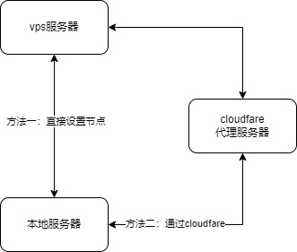
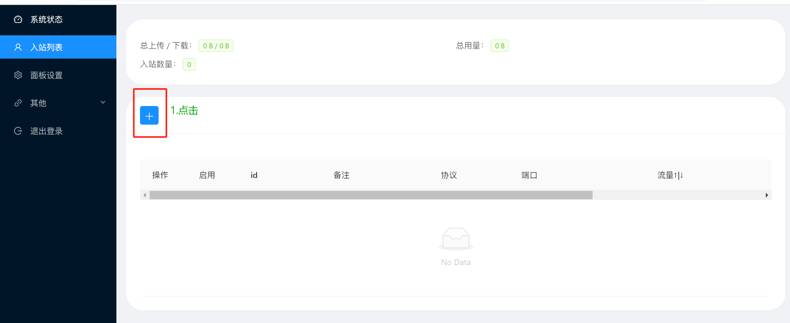
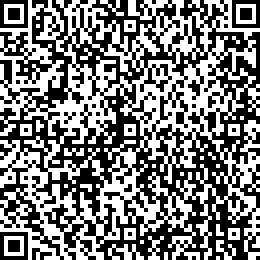
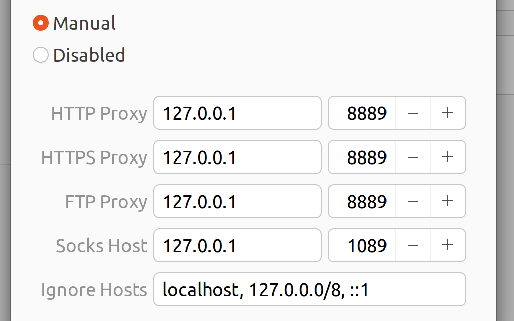
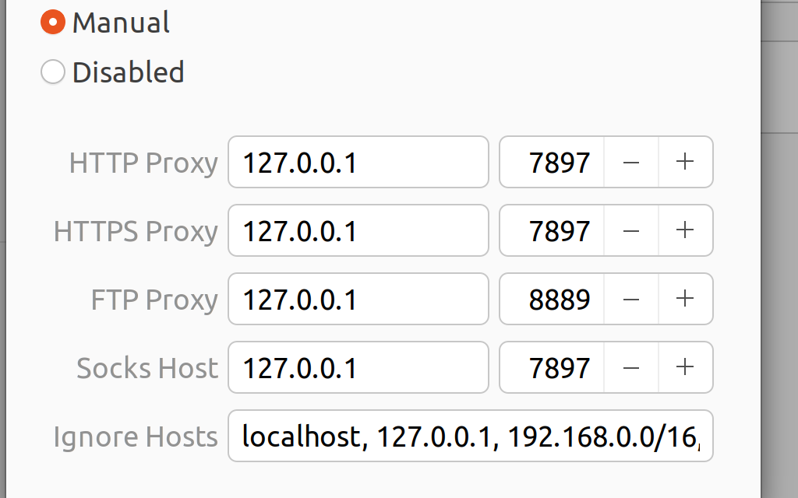

#  vpn搭建



两种方法，通过cloudfare代理，可以增强安全性和连接速度（或许会提高速度）。

## vmess协议+ws传输

1. 进入vps，用`ssh -p <端口号> root@<IPv4地址>`
2. 安装x-ui，用`bash <(curl -Ls https://raw.githubusercontent.com/vaxilu/x-ui/master/install.sh)`
3. （可选）申请SSL证书：查看[x-ui的github官网](https://github.com/vaxilu/x-ui)里有SSL证书申请方法介绍
4. x-ui端口设置，注意购买的nat机器的端口范围是多少，端口设置成范围内
5. 登入x-ui面板




6. 把二维码拷贝下来，就可以用了

# ssh证书申请

1. x-ui 申请ssh证书
2. 输入cloudfare托管的对应域名
3. 输入cloudfare的global api key
4. 输入注册的邮箱
5. 成功

global api key:`ded583f0b737b9ae43e7626b5b888e52b039d`

# vpn使用

* 安装v2ray工具

需要先安装v2ray内核，然后安装下面的GUI

安卓：<https://github.com/2dust/v2rayNG/releases>

windows：<https://github.com/2dust/v2rayN/releases/download/6.42/v2rayN-With-Core.zip>

ubuntu：<https://github.com/Qv2ray/Qv2ray?tab=readme-ov-file>

> **注意**：windows要下载v2rayN-With-Core.zip

* 扫码添加节点

1. 安装后扫码



或者添加

```
vmess://ewogICJ2IjogIjIiLAogICJwcyI6ICJ2bWVzcyt3c3w5RTVvLmxvdmVAeHJheS5jb20iLAogICJhZGQiOiAiWzJhMTI6YmVjMDoxNjg6NDg4OjpdIiwKICAicG9ydCI6IDU0ODUyLAogICJpZCI6ICI3ZGUyMDlkYS01OGVjLTQ1NDMtZTA1Yy00NjZlMWZjNjkzMmIiLAogICJhaWQiOiAwLAogICJuZXQiOiAid3MiLAogICJ0eXBlIjogIm5vbmUiLAogICJob3N0IjogIiIsCiAgInBhdGgiOiAiLzdkZTIwOWRhIiwKICAidGxzIjogIm5vbmUiCn0=
```

2. 扫码


或者添加

```
vmess://ewogICJ2IjogIjIiLAogICJwcyI6ICJKYXBhbiIsCiAgImFkZCI6ICJbMmExMjpiZWMwOjE2NToxYjQ6Ol0iLAogICJwb3J0IjogMzM5MDQsCiAgImlkIjogImU5MDdiZWJhLTA1MTctNDMxMi1lNDBlLWU0ZDQ5NmFmYTE5NCIsCiAgImFpZCI6IDUsCiAgIm5ldCI6ICJ3cyIsCiAgInR5cGUiOiAibm9uZSIsCiAgImhvc3QiOiAiIiwKICAicGF0aCI6ICIvZTkwN2JlYmEiLAogICJ0bHMiOiAibm9uZSIKfQ==
```

# 机场vpn购买

* fscloud

网站：`https://ginle1171.fsc.fscloud.cc/`

账号：`779117133@qq.com`

密码：`jjjj123456`

订阅链接：`http://fs123121.cdn.22.jiacdnd123456789.com/answer/land?token=ea88310021300916f9f282b52d4e39c9`

* kaochang

网站：`https://reborn.kaochang.ltd/`

账号：`779117133@qq.com`

密码：`jjjj123456`

订阅链接：`https://kaochang.cheap/api/v1/client/subscribe?token=37843a218f37806df93a380f86109c0a`

代理配置(可能，需要尝试)：




